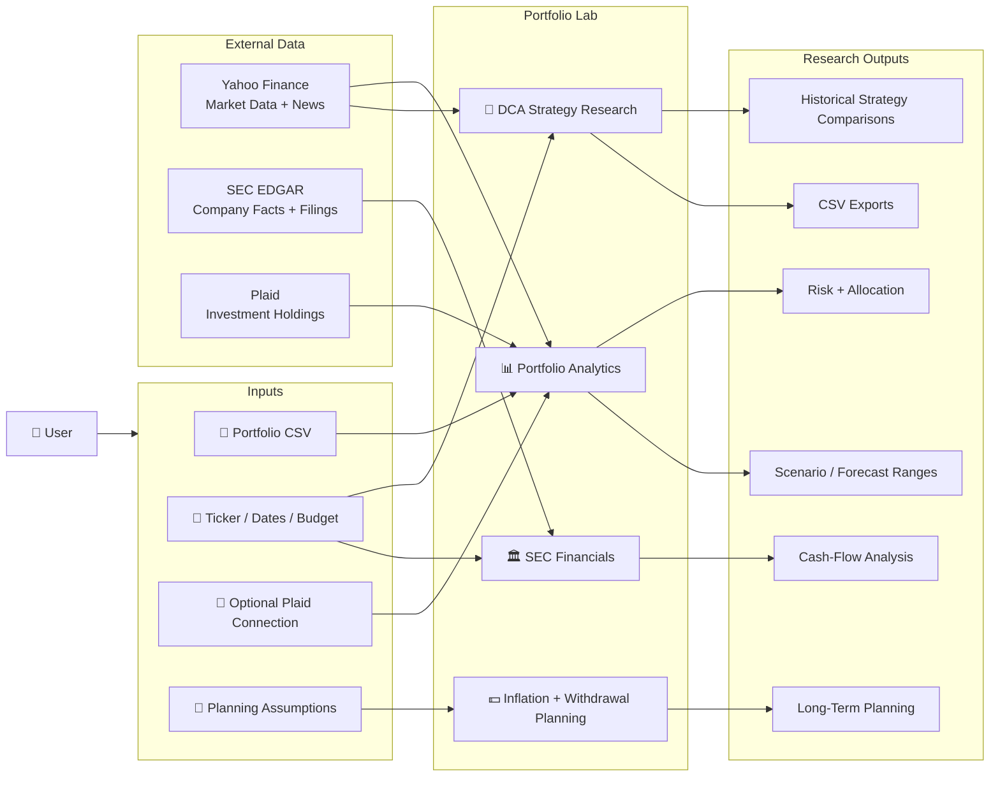
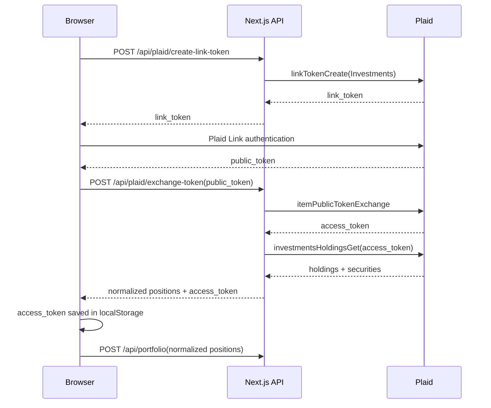
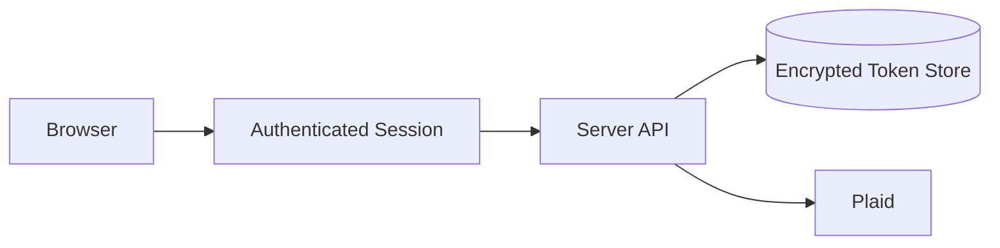
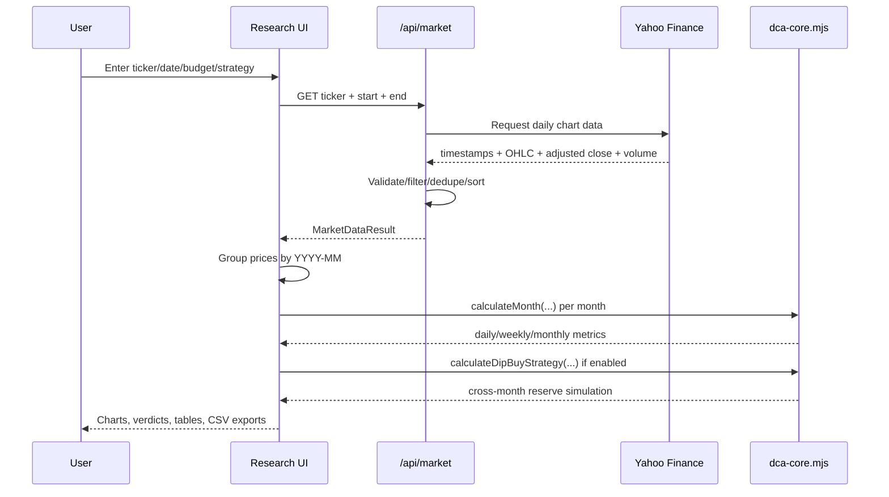
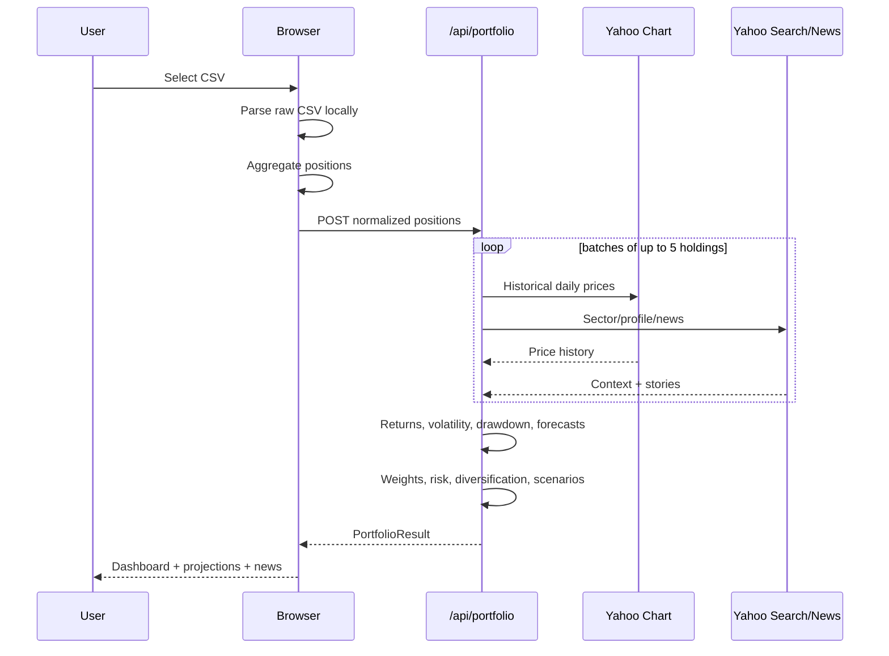
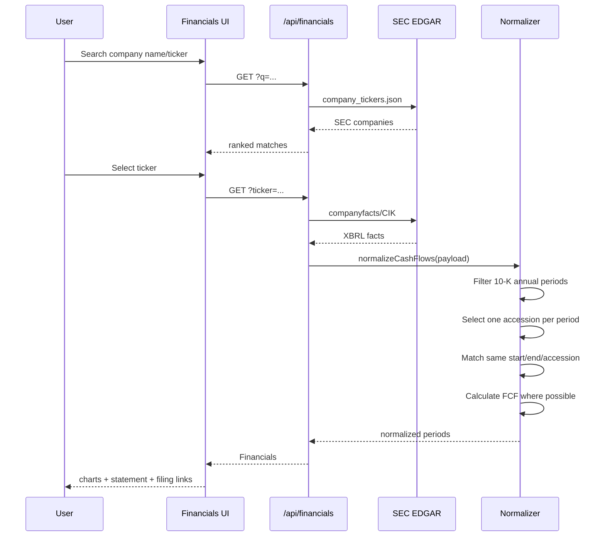
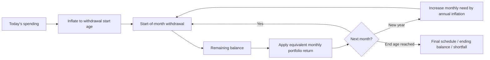
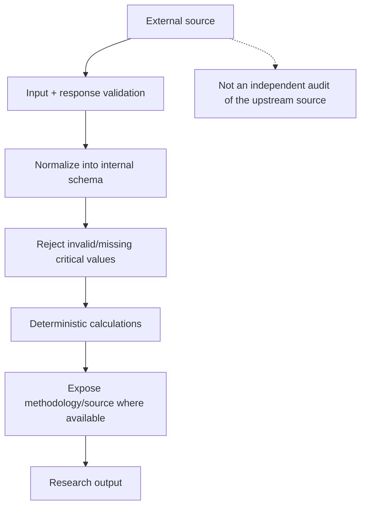
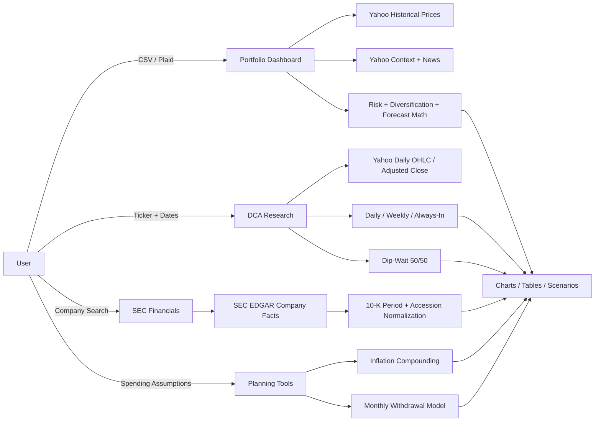

<div align="center">

# 📈 Portfolio Lab

### **A full-stack investment research laboratory for understanding how portfolios, investment timing, company cash flows, inflation, and long-term withdrawal plans behave over time.**

<p>
  <strong>Research historical strategies · Analyze portfolio risk · Inspect SEC fundamentals · Model long-term outcomes</strong>
</p>

<p>
  
  
  
  
</p>

<p>
  
  
  
  
</p>

**Portfolio analytics • DCA research • historical strategy simulation • SEC cash-flow analysis • forecasting • inflation planning • retirement withdrawal modeling**

</div>

---

## 🌐 What is Portfolio Lab?

**Portfolio Lab is a browser-based, full-stack personal investment research application that brings several different investing research workflows into one unified workspace.** Instead of using one website for historical prices, another spreadsheet for dollar-cost averaging, another service for portfolio allocation, another source for SEC filings, and a separate calculator for inflation or retirement withdrawals, this project connects those workflows behind a single interface and a consistent calculation layer.

At its core, the application answers a family of practical research questions:

> **What do I own, how concentrated or volatile has it been, what happened historically under different investment schedules, what do the company's reported cash flows show, and how might different long-term planning assumptions change the outcome?**

The project is not simply a stock-price viewer. It is designed as an **investment research laboratory**. The application gathers market or filing data, transforms it into structured observations, applies explicit mathematical rules, and presents the results through dashboards, charts, tables, comparisons, scenario cards, exports, and drill-down views.

It supports both **security-level research** and **portfolio-level research**. A user can study a single stock or ETF using historical timing simulations, or upload/connect a portfolio and analyze its holdings as a group. Separate workspaces cover company fundamentals, inflation, and long-horizon withdrawal planning.

### ✨ Project at a glance

| | Research workspace | What it helps answer |
|:--:|---|---|
| 📊 | **Portfolio Dashboard** | What do I own, what is it worth, how is it allocated, and where are the major concentration or historical-risk exposures? |
| 🧪 | **DCA Strategy Lab** | How would Daily DCA, Weekly DCA, monthly Always-In, or Dip-Wait investing have behaved over historical periods? |
| 🏛️ | **SEC Financials** | What annual cash-flow figures did the company actually report in its SEC filings, and which filing supports each period? |
| 🔭 | **Portfolio Forecasting** | What do long-horizon scenario calculations look like when historical return/risk inputs are transformed into modeled outcomes? |
| 📰 | **Holding News Context** | What recent stories are associated with portfolio holdings, and what lightweight headline tone does the application detect? |
| 💵 | **Inflation Calculator** | How does purchasing power change as inflation compounds over time? |
| 🏖️ | **Withdrawal Planner** | How might an inflation-adjusted withdrawal schedule interact with assumed investment growth over a long retirement horizon? |
| 🔌 | **Portfolio Ingestion** | How can holdings enter the system through a local CSV workflow or an optional Plaid brokerage connection? |
| 📤 | **Research Exports** | How can detailed DCA results be exported for independent spreadsheet analysis or record keeping? |

### 🎯 What the project is designed to do

Portfolio Lab combines **data acquisition**, **normalization**, **financial mathematics**, **historical simulation**, **portfolio aggregation**, and **interactive visualization**.

The application can:

- ingest portfolio information from a CSV file and convert transaction-like rows into normalized positions;
- optionally connect supported brokerage data through Plaid's Investments flow;
- retrieve historical market observations for stocks and ETFs;
- calculate estimated portfolio value, holding weights, sector allocation, volatility, maximum drawdown, concentration, and effective-holdings measures;
- simulate recurring investment schedules using the actual historical trading calendar rather than assuming every calendar day is investable;
- compare multiple investment-timing rules under the same monthly budget;
- create holding-level historical scenario inputs and aggregate them into portfolio-level long-horizon estimates;
- gather recent holding-related news context;
- retrieve SEC Company Facts data and construct annual cash-flow periods while preserving filing provenance;
- calculate free cash flow from normalized financial statement values;
- model the erosion of purchasing power caused by inflation;
- simulate long-term inflation-adjusted portfolio withdrawals; and
- export research output for further inspection outside the application.

### 🧠 How to think about Portfolio Lab

A useful mental model is to think of the project as **four layers**:

1. **Inputs** — ticker symbols, dates, budgets, CSV positions, optional brokerage holdings, inflation assumptions, and withdrawal assumptions.
2. **Data** — historical Yahoo Finance market observations, Yahoo Finance search/news context, SEC EDGAR Company Facts and filing metadata, and optional Plaid investment holdings.
3. **Research engines** — DCA math, portfolio risk calculations, scenario/forecast logic, financial-statement normalization, inflation math, and withdrawal-plan calculations.
4. **Outputs** — charts, tables, portfolio diagnostics, strategy comparisons, scenario ranges, financial statements, exported CSV files, and planning projections.

The calculations are deliberately separated from the visual interface where practical. For example, reusable DCA calculations live in `lib/dca-core.mjs`, withdrawal calculations live in `lib/withdrawal-plan.mjs`, financial normalization logic lives in `lib/financials.ts`, and external market/SEC acquisition logic lives in dedicated data modules and API routes. This makes the project easier to reason about and makes core behavior testable independently from the React UI.

### 🔎 What makes the data traceable?

The project uses different data sources for different jobs rather than presenting all information as though it came from one provider:

- **Yahoo Finance chart data** supplies historical market observations used by the market-data and portfolio workflows.
- **Yahoo Finance search/news endpoints** provide ticker discovery/context and recent story metadata used in the news experience.
- **SEC EDGAR Company Facts** supplies reported company financial facts.
- **SEC filing accession metadata** is preserved when annual financial periods are normalized so the application can associate a displayed period with the filing used to construct it.
- **Plaid**, when configured and explicitly connected by the user, supplies brokerage investment holdings.
- **CSV uploads** supply user-provided portfolio transactions/positions and are initially parsed in the browser before derived position information is analyzed by the server.

“Verified” in this README therefore means **traceable to the application's source data and reproducible by its documented calculation rules**. It does **not** mean that every external market value is guaranteed by the application, that every third-party endpoint is immutable, or that modeled future returns are facts. Forecasts and scenarios are mathematical research outputs built from assumptions and historical observations—not verified future performance.

### 🛡️ What Portfolio Lab is *not*

Portfolio Lab is intentionally a **research and education tool**. It is **not**:

- a brokerage or trade-execution system;
- an investment adviser or robo-adviser;
- a tax calculation engine;
- an accounting system;
- a guaranteed real-time quote terminal;
- a guarantee of future investment performance;
- a substitute for official SEC filings, brokerage statements, or professional financial advice; or
- a prediction engine capable of knowing future returns.

The purpose of its forecasts, scenarios, strategy comparisons, and historical simulations is to help a user **inspect assumptions and understand behavior**, not to turn uncertain future outcomes into certainties.

### 🗺️ The project in one picture



### ✅ Current verification snapshot

> **Automated core-suite status:** `29 / 29` tests pass under the repository's current default `npm test` command.
>
> The repository also contains `tests/financials.test.mjs`, but that file is not currently part of the default `npm test` command and cannot be executed directly with plain Node because it imports a TypeScript module without a TypeScript-aware loader. The testing section later in this README documents that distinction explicitly.

---

## Table of Contents

- [1. What this project is](#1-what-this-project-is)
- [2. What the application can do](#2-what-the-application-can-do)
- [3. High-level architecture](#3-high-level-architecture)
- [4. Technology stack](#4-technology-stack)
- [5. Repository structure](#5-repository-structure)
- [6. Workspace 1 — Portfolio Dashboard](#6-workspace-1--portfolio-dashboard)
- [7. Portfolio CSV ingestion](#7-portfolio-csv-ingestion)
- [8. Optional Plaid brokerage connection](#8-optional-plaid-brokerage-connection)
- [9. Portfolio market-data enrichment](#9-portfolio-market-data-enrichment)
- [10. Portfolio risk, diversification, and concentration math](#10-portfolio-risk-diversification-and-concentration-math)
- [11. Portfolio forecast model](#11-portfolio-forecast-model)
- [12. Scenario cards and future-value math](#12-scenario-cards-and-future-value-math)
- [13. Portfolio news and headline sentiment](#13-portfolio-news-and-headline-sentiment)
- [14. Workspace 2 — DCA / investment-strategy research](#14-workspace-2--dca--investment-strategy-research)
- [15. Daily DCA](#15-daily-dca)
- [16. Weekly DCA](#16-weekly-dca)
- [17. Always-In / monthly lump purchase](#17-always-in--monthly-lump-purchase)
- [18. Dip-Wait 50/50](#18-dip-wait-5050)
- [19. Historical market-data pipeline](#19-historical-market-data-pipeline)
- [20. Price-field and adjusted-close behavior](#20-price-field-and-adjusted-close-behavior)
- [21. DCA exports and drill-downs](#21-dca-exports-and-drill-downs)
- [22. Workspace 3 — SEC company financials](#22-workspace-3--sec-company-financials)
- [23. How SEC annual cash flow is normalized](#23-how-sec-annual-cash-flow-is-normalized)
- [24. Inflation calculator](#24-inflation-calculator)
- [25. Inflation-adjusted withdrawal planner](#25-inflation-adjusted-withdrawal-planner)
- [26. API reference](#26-api-reference)
- [27. Data provenance and what “verified” means here](#27-data-provenance-and-what-verified-means-here)
- [28. Caching and request behavior](#28-caching-and-request-behavior)
- [29. Security and privacy model](#29-security-and-privacy-model)
- [30. Installation](#30-installation)
- [31. Environment variables](#31-environment-variables)
- [32. Running locally](#32-running-locally)
- [33. Testing](#33-testing)
- [34. Deployment](#34-deployment)
- [35. External model-context integration](#35-external-model-context-integration)
- [36. Important assumptions and limitations](#36-important-assumptions-and-limitations)
- [37. Known implementation caveats](#37-known-implementation-caveats)
- [38. Troubleshooting](#38-troubleshooting)
- [39. Suggested production hardening](#39-suggested-production-hardening)
- [40. Formula reference](#40-formula-reference)
- [41. End-to-end request diagrams](#41-end-to-end-request-diagrams)
- [42. FAQ](#42-faq)
- [43. Disclaimer](#43-disclaimer)
- [44. License status](#44-license-status)

---

# 1. What this project is

**Portfolio Lab** is a browser-based personal investment research application built with the Next.js App Router. It combines several normally separate workflows into one interface:

1. **Portfolio snapshot analysis** from a CSV file or an optional Plaid brokerage connection.
2. **Historical investment-timing research** for a single stock or ETF.
3. **Daily DCA, weekly DCA, monthly “Always-In,” and Dip-Wait 50/50 simulations.**
4. **Portfolio risk and diversification diagnostics.**
5. **Holding-by-holding multi-horizon historical scenario modeling.**
6. **Current holding-related news aggregation and lightweight headline sentiment.**
7. **Annual company cash-flow analysis from SEC EDGAR Company Facts.**
8. **Inflation planning.**
9. **Inflation-adjusted retirement/withdrawal planning.**
10. **CSV exports for detailed research results.**

The application is intentionally designed as a **research and education tool**, not as an order-execution platform, broker, robo-advisor, tax engine, or promise of future returns.

The package name in `package.json` is `dca-research-lab`, while the visible application brand and metadata use **Portfolio Lab**.

---

# 2. What the application can do

| Area | Capability | Main implementation |
|---|---|---|
| Portfolio | Upload holdings/transaction CSV | `components/portfolio-dashboard.tsx` |
| Portfolio | Parse buys, sells, quantities, amounts, dates | `positionsFromCsv()` |
| Portfolio | Connect a brokerage through Plaid | `app/api/plaid/*` |
| Portfolio | Fetch up to ~31 years of daily history per holding | `app/api/portfolio/route.ts` |
| Portfolio | Calculate current estimated market value | `/api/portfolio` |
| Portfolio | Calculate holding weights | `/api/portfolio` |
| Portfolio | Analyze historical volatility | `/api/portfolio` |
| Portfolio | Analyze historical max drawdown | `/api/portfolio` |
| Portfolio | Calculate concentration / effective holdings | `/api/portfolio` |
| Portfolio | Calculate sector allocation | `/api/portfolio` |
| Portfolio | Build 1–50 year holding forecasts | `/api/portfolio` |
| Portfolio | Build percentile scenario bands | `/api/portfolio` |
| Portfolio | Project future value with monthly contributions | `futureValue()` |
| Portfolio | Fetch recent Yahoo Finance stories | `getTickerContext()` |
| Portfolio | Classify headline tone | `sentiment()` |
| DCA Research | Search a U.S. stock or ETF ticker | `/api/market` |
| DCA Research | Compare Daily DCA | `calculateMonth()` |
| DCA Research | Compare Weekly DCA | `calculateMonth()` |
| DCA Research | Compare monthly Always-In purchase | `calculateMonth()` |
| DCA Research | Simulate Dip-Wait 50/50 | `calculateDipBuyStrategy()` |
| DCA Research | Change monthly purchase day | UI + `calculateMonth()` |
| DCA Research | Use a custom monthly budget | UI + `calculateMonth()` |
| DCA Research | Export daily/weekly CSV details | `downloadCsv()` |
| Financials | Search SEC registrants | `/api/financials?q=` |
| Financials | Load annual 10-K cash-flow facts | `/api/financials?ticker=` |
| Financials | Normalize annual periods by filing accession | `normalizeCashFlows()` |
| Financials | Calculate free cash flow | `lib/financials.ts` |
| Financials | Link directly to filing source | `components/company-financials.tsx` |
| Planning | Inflation calculator | `components/inflation-calculator.tsx` |
| Planning | Withdrawal planner | `components/withdrawal-planner.tsx` |
| Platform | Light / dark theme | `app/page.tsx` |
| Platform | Security headers | `next.config.ts` |
| Platform | Vercel deployment config | `vercel.json` |

---

# 3. High-level architecture

```mermaid
flowchart TB
    U[User Browser]

    subgraph CLIENT[Client-side React UI]
        NAV[Workspace Navigation]
        PORT[Portfolio Dashboard]
        DCA[DCA Research]
        FIN[Company Financials]
        INF[Inflation Calculator]
        WD[Withdrawal Planner]
        CSV[Browser CSV Parser]
    end

    subgraph NEXT[Next.js Server / API Routes]
        MARKET[/api/market]
        PAPI[/api/portfolio]
        FAPI[/api/financials]
        PLINK[/api/plaid/create-link-token]
        PEX[/api/plaid/exchange-token]
        PHOLD[/api/plaid/holdings]
    end

    subgraph CORE[Local Calculation Modules]
        DCACORE[lib/dca-core.mjs]
        WCORE[lib/withdrawal-plan.mjs]
        FINCORE[lib/financials.ts]
        MD[lib/market-data.ts]
        SEC[lib/sec-data.ts]
    end

    subgraph EXTERNAL[External Data Providers]
        YCHART[Yahoo Finance Chart API]
        YSEARCH[Yahoo Finance Search / News]
        EDGAR[SEC EDGAR / Company Facts]
        PLAID[Plaid Investments API]
    end

    U --> NAV
    NAV --> PORT
    NAV --> DCA
    NAV --> FIN
    PORT --> INF
    PORT --> WD
    PORT --> CSV

    DCA --> MARKET
    MARKET --> MD
    MD --> YCHART
    DCA --> DCACORE

    PORT --> PAPI
    PAPI --> MD
    PAPI --> YCHART
    PAPI --> YSEARCH

    FIN --> FAPI
    FAPI --> SEC
    SEC --> EDGAR
    SEC --> FINCORE

    PORT --> PLINK
    PORT --> PEX
    PORT --> PHOLD
    PLINK --> PLAID
    PEX --> PLAID
    PHOLD --> PLAID

    WD --> WCORE
```

The project has **no database dependency** in the supplied repository. Calculations are performed either:

- directly in the browser,
- in stateless Next.js route handlers,
- or from external APIs requested by those route handlers.

---

# 4. Technology stack

## Application framework

- **Next.js 16.3.4**
- **React 19.2.6**
- **React DOM 19.2.6**
- **TypeScript 5.9.3**
- Node engine requirement: **Node >= 22.13.0**

## UI

- Tailwind CSS 4
- Radix UI
- shadcn-style local UI primitives
- Lucide React icons
- Recharts 3.8

## Integrations

- Yahoo Finance chart endpoint for daily price history
- Yahoo Finance search endpoint for company context/news
- SEC EDGAR / XBRL Company Facts for annual cash-flow facts
- Plaid Investments API for optional brokerage holdings connection

## Quality / tooling

- ESLint 9
- `eslint-config-next`
- Node's built-in test runner
- Vercel deployment configuration

---

# 5. Repository structure

```text
StockComparison-main/
├── app/
│   ├── api/
│   │   ├── financials/
│   │   │   └── route.ts
│   │   ├── market/
│   │   │   └── route.ts
│   │   ├── plaid/
│   │   │   ├── create-link-token/route.ts
│   │   │   ├── exchange-token/route.ts
│   │   │   └── holdings/route.ts
│   │   └── portfolio/
│   │       └── route.ts
│   ├── design-system.css
│   ├── globals.css
│   ├── layout.tsx
│   └── page.tsx
├── components/
│   ├── company-financials.tsx
│   ├── financial-chart-tooltip.tsx
│   ├── inflation-calculator.tsx
│   ├── portfolio-dashboard.tsx
│   ├── withdrawal-planner.tsx
│   └── ui/
│       ├── button.tsx
│       ├── input.tsx
│       ├── select.tsx
│       ├── sheet.tsx
│       └── table.tsx
├── lib/
│   ├── dca-core.d.mts
│   ├── dca-core.mjs
│   ├── financials.ts
│   ├── market-data.ts
│   ├── sec-data.ts
│   ├── utils.ts
│   ├── withdrawal-plan.d.mts
│   └── withdrawal-plan.mjs
├── public/
│   └── favicon.svg
├── tests/
│   ├── dca.test.mjs
│   ├── financials.test.mjs
│   ├── portfolio.test.mjs
│   └── withdrawal.test.mjs
├── vendor/
│   ├── shadcn-tailwind-4.13.0.LICENSE.md
│   └── shadcn-tailwind-4.13.0.css
├── .gitattributes
├── .gitignore
├── .npmrc
├── AGENTS.md
├── CLAUDE.md
├── components.json
├── eslint.config.mjs
├── next.config.ts
├── package-lock.json
├── package.json
├── postcss.config.mjs
├── tsconfig.json
├── VERCEL.md
└── vercel.json
```

## Key file responsibilities

### `app/page.tsx`

The main application shell and the complete DCA Research workspace. It manages:

- top-level navigation between Portfolio, Research, and Financials,
- historical ticker search,
- date ranges,
- monthly budget inputs,
- purchase day,
- price mode,
- strategy toggles,
- monthly calculations,
- cumulative calculations,
- chart data,
- tables,
- detail sheets,
- CSV export,
- theme switching,
- and optional external `document.modelContext` tool registration.

### `components/portfolio-dashboard.tsx`

The portfolio workflow. It owns:

- CSV parsing,
- Plaid Link integration,
- saved Plaid token refresh,
- portfolio upload state,
- scenario controls,
- risk/diversification rendering,
- portfolio projection rendering,
- holdings table,
- news groups,
- inflation calculator,
- withdrawal planner.

### `lib/dca-core.mjs`

Pure calculation logic for:

- daily DCA,
- weekly DCA,
- monthly Always-In purchases,
- selected purchase-day handling,
- cost basis,
- ending values,
- Dip-Wait 50/50 simulation.

### `app/api/portfolio/route.ts`

Server-side portfolio analytics. It enriches user positions with historical data and computes:

- market value,
- portfolio weights,
- one-year return,
- annualized volatility,
- max drawdown,
- historical period returns,
- per-horizon holding forecasts,
- scenario curves,
- concentration,
- diversification,
- risk score,
- downside proxy,
- sector groups,
- timeline statistics,
- news,
- headline sentiment.

### `lib/market-data.ts`

The market-data abstraction and current Yahoo Finance implementation.

### `lib/sec-data.ts` + `lib/financials.ts`

SEC company lookup and annual cash-flow normalization.

### `lib/withdrawal-plan.mjs`

Pure withdrawal-plan math independent from React.

---

# 6. Workspace 1 — Portfolio Dashboard

The Portfolio Dashboard is the default top-level view.

It is designed to answer questions such as:

- What is my portfolio worth based on the latest returned daily prices?
- How concentrated am I?
- Which holdings dominate the portfolio?
- Which sectors dominate the portfolio?
- How volatile have my holdings historically been?
- What did weak, middle, and strong historical periods look like?
- What might the portfolio look like over 1–50 years under different rates?
- How much of the future value comes from contributions vs. estimated investment growth?
- What current news is attached to the holdings?
- If my uploaded CSV includes transaction amounts and dates, what is the cash-vs-current-value picture?

The dashboard accepts portfolio information in two ways:

1. **CSV upload**
2. **Plaid brokerage connection**

The two input paths ultimately produce approximately the same internal position shape:

```ts
type ParsedPosition = {
  ticker: string;
  quantity: number;
  netInvested: number;
  firstInvestmentDate: string | null;
};
```

The browser sends these normalized positions to:

```text
POST /api/portfolio
```

The route returns enriched portfolio analytics.

---

# 7. Portfolio CSV ingestion

## Where parsing happens

CSV text is read and parsed in the browser by `positionsFromCsv()` in:

```text
components/portfolio-dashboard.tsx
```

The **raw CSV file is not uploaded as a file object** to the application API in the current implementation.

However, it is important to understand the privacy boundary correctly:

> The raw file is parsed client-side, but the normalized position data — ticker, quantity, derived net-invested amount, and first investment date — is sent to `/api/portfolio` for analysis.

So “raw CSV stays private” does **not** mean “nothing derived from the CSV leaves the browser.”

## CSV parser behavior

The parser supports quoted CSV cells and doubled quote escaping.

Example:

```csv
Ticker,Quantity,Action,Amount,Date
AAPL,10,Buy,1500,2025-01-15
VOO,4,Buy,2200,2025-02-10
AAPL,2,Sell,380,2025-08-20
```

## Recognized ticker columns

Any one of:

```text
instrument
ticker
symbol
```

## Recognized quantity columns

Any one of:

```text
quantity
shares
share quantity
```

## Recognized transaction/action columns

Any one of:

```text
trans code
action
type
transaction type
```

If there is no action column, rows are treated like position/holding rows.

## Recognized amount / cost columns

Any one of:

```text
amount
net amount
cost basis
```

If an amount is missing or zero, the parser can fall back to:

```text
quantity × price
```

using one of:

```text
price
average price
avg price
```

## Recognized date columns

Any one of:

```text
activity date
date
transaction date
trade date
settlement date
```

## Buy / sell aggregation

The parser converts transactions into a net position:

```text
Buy  -> +quantity, +amount
Sell -> -quantity, -amount
```

The earliest positive buy date is retained as `firstInvestmentDate`.

Positions with final quantity <= `0.0000001` are discarded.

## Important cost-basis limitation

`netInvested` is a simple accumulated amount based on the uploaded rows. It is not a complete tax-lot accounting engine.

The project does **not** implement:

- FIFO tax lots,
- LIFO tax lots,
- specific identification,
- wash-sale accounting,
- realized vs. unrealized tax separation,
- fees/commissions unless already reflected in the CSV amount,
- corporate-action reconstruction,
- transfers between accounts,
- dividend reinvestment transaction reconstruction.

If the CSV is incomplete, the resulting position history can also be incomplete.

---

# 8. Optional Plaid brokerage connection

Portfolio Lab contains an optional Plaid Investments integration.

## Relevant routes

```text
POST /api/plaid/create-link-token
POST /api/plaid/exchange-token
POST /api/plaid/holdings
```

## Flow



## Required environment variables

```env
PLAID_CLIENT_ID=your_client_id
PLAID_SECRET=your_secret
PLAID_ENV=sandbox
```

`PLAID_ENV` defaults to `sandbox` if omitted.

## Current position mapping

For each positive Plaid holding with a ticker:

```text
ticker      = security.ticker_symbol
quantity    = holding.quantity
netInvested = holding.institution_price × holding.quantity
```

The current code uses `holding.institution_price_as_of` as `firstInvestmentDate` when available.

### Important interpretation

That is **not necessarily the investor's true first purchase date**.

Likewise:

```text
institution_price × quantity
```

is an approximation used by this implementation and is **not guaranteed to be a true historical cost basis**.

## Duplicate consolidation

If multiple holdings use the same ticker:

- quantities are added,
- `netInvested` values are added,
- the earliest available mapped date is retained.

## Security note

The current implementation returns the Plaid `access_token` to the browser and stores it in `localStorage`.

That is convenient for a personal prototype but is **not the preferred architecture for a hardened production financial application**.

For production, see [Suggested production hardening](#39-suggested-production-hardening).

---

# 9. Portfolio market-data enrichment

The `/api/portfolio` route accepts up to **40 positive ticker positions**.

Ticker format is validated with:

```regex
^[A-Z0-9.-]{1,12}$
```

## Historical range

For portfolio analysis the route requests approximately:

```text
31 years + 45 days
```

of daily market history for each holding, ending on the current server date.

Holdings are processed in batches of five.

## Price used for return calculations

Portfolio return analysis uses:

```text
adjustedClose if available and > 0
otherwise close
```

This is implemented by `returnPrice()`.

## Per-holding calculations

For each usable holding the API calculates:

- latest returned close,
- latest price date,
- estimated market value,
- one-year return,
- annualized volatility,
- maximum drawdown,
- 1/2/3/5/10/15/20/30-year historical returns when available,
- historical CAGR over all returned history,
- forecast metadata for every horizon from 1 to 50 years,
- sector,
- industry,
- recent news,
- timeline returns when a usable first-investment date exists.

## Current estimated market value

```text
marketValue = quantity × latestClose
```

Portfolio total value is:

```text
totalValue = Σ holdingMarketValue
```

Portfolio weight is:

```text
weight_i = marketValue_i / totalValue
```

---

# 10. Portfolio risk, diversification, and concentration math

The portfolio route intentionally uses transparent heuristic scores rather than a hidden external scoring service.

## Annualized holding volatility

The code computes daily log returns:

```text
r_t = ln(P_t / P_(t-1))
```

Then sample standard deviation and annualization:

```text
annualVolatility = stdev(daily log returns) × √252
```

## Important portfolio-volatility detail

The displayed portfolio volatility input to the risk model is:

```text
portfolioVolatility = Σ(weight_i × volatility_i)
```

This is a **weighted volatility proxy**.

It is **not** a covariance-matrix portfolio volatility calculation. Correlations between holdings are not modeled.

## Maximum drawdown

The route tracks the running peak and finds the worst decline from that peak:

```text
drawdown_t = P_t / peak_t - 1
maxDrawdown = minimum(drawdown_t)
```

## Concentration index

The code uses a Herfindahl-style concentration value:

```text
concentrationIndex = Σ(weight_i²)
```

Examples:

- one 100% holding -> `1.00`
- four equal 25% holdings -> `0.25`
- ten equal 10% holdings -> `0.10`

## Effective number of holdings

```text
effectiveHoldings = 1 / concentrationIndex
```

This gives a concentration-adjusted count, not merely the raw number of tickers.

## Sector concentration

Sector HHI is computed similarly:

```text
sectorHHI = Σ(sectorWeight²)
```

## Risk score

The current implementation builds three components:

```text
volatility component   = (portfolioVolatility / 0.5) × 45
largest holding        = largestWeight × 35
concentration component= concentrationIndex × 55
```

Then:

```text
riskScore = round(clamp(sum, 0, 100))
```

Labels:

```text
70–100 -> High
45–69  -> Moderate
0–44   -> Lower
```

## Diversification score

The current components are:

```text
concentrationSpread = (1 - concentrationIndex) × 52
effectiveHoldings   = min(1, effectiveHoldings / 10) × 28
sectorSpread        = (1 - sectorHHI) × 20
```

Then:

```text
diversificationScore = round(clamp(sum, 0, 100))
```

Labels:

```text
75–100 -> Broad
50–74  -> Moderate
0–49   -> Concentrated
```

## “Realistic downside” proxy

The API calculates:

```text
floor = 5%
bearDownside = max(0, -oneYearBearScenario)
volatilityAndConcentration = portfolioVolatility × 0.72 + largestWeight × 0.08
cap = 65%
```

Then:

```text
realisticDownside = clamp(
  max(floor, bearDownside, volatilityAndConcentration),
  5%,
  65%
)
```

This is a planning heuristic, not Value-at-Risk, expected shortfall, or a guaranteed maximum loss.

## New-money strategy fit heuristic

The API currently classifies the portfolio as follows:

```text
if riskScore >= 65 OR largestWeight >= 30%:
    dailyDca
else if riskScore <= 35 AND diversificationScore >= 65:
    alwaysIn
else:
    blend
```

This is an application heuristic based only on historical price behavior and allocation structure. It does not know the user's income, tax situation, liquidity needs, risk tolerance, investment policy, time-to-goal, or legal constraints.

---

# 11. Portfolio forecast model

The portfolio model is historical and heuristic. It is designed to create transparent scenario inputs, not to claim knowledge of the future.

Every holding is modeled separately for each horizon from **1 through 50 years**.

## 11.1 Historical CAGR

For a holding's full available history:

```text
rawHistoricalCagr = (latestPrice / firstPrice)^(1 / elapsedYears) - 1
```

## 11.2 Horizon-dependent maximum growth clamp

The model defines:

```text
maxAllowableGrowth = clamp(
  0.10 + 0.60 / √years,
  0.10,
  0.50
)
```

This makes very high annual rates harder to sustain in long-horizon projections.

Then long-term growth is bounded:

```text
longTermGrowth = clamp(rawHistoricalCagr, -25%, maxAllowableGrowth)
```

## 11.3 Rolling CAGR samples

For each requested horizon:

```text
window ≈ years × 252 trading days
```

with a floor of 200 trading days.

The route samples rolling windows approximately every 21 trading days.

For each valid window:

```text
rollingCAGR = (endPrice / startPrice)^(1 / years) - 1
```

## 11.4 One-year returns

When sufficient history exists, the route constructs 252-trading-day return samples.

These provide another distribution when a holding does not have enough full multi-year rolling windows.

## 11.5 Recent growth

The most recent approximately one-year return is bounded:

```text
recentGrowth = clamp(oneYearReturn, -75%, +125%)
```

## 11.6 Weighting recent vs. historical vs. long-term behavior

Recent weight:

```text
recentWeight = clamp(0.30 / √years, 0.05, 0.30)
```

Long-term weight:

```text
longTermWeight = 0.30
```

Historical weight:

```text
historicalWeight = 1 - recentWeight - longTermWeight
```

Therefore the one-year move matters more at short horizons and less at long horizons.

## 11.7 Historical central estimate

When at least four rolling horizon samples exist, the model uses the relevant rolling distribution.

Otherwise it derives a horizon-adjusted estimate from yearly return history.

## 11.8 Risk deduction

Per holding:

```text
riskDeduction = clamp(
  0.20 × volatility² / √years,
  0,
  8%
)
```

## 11.9 Holding planning rate

Before the risk deduction:

```text
beforeRisk =
    recentWeight × recentGrowth
  + historicalWeight × historicalGrowth
  + longTermWeight × longTermGrowth
```

Then:

```text
annualRate = clamp(
  beforeRisk - riskDeduction,
  -30%,
  maxAllowableGrowth
)
```

## 11.10 Percentile scenarios

The holding's historical distribution is used to create:

```text
worst -> ~5th percentile
bear  -> ~25th percentile
base  -> ~50th percentile
bull  -> ~75th percentile
best  -> ~95th percentile
```

The application also computes a historical mean-like `average` scenario.

## 11.11 Portfolio aggregation

Each holding contributes according to its **current market-value weight**:

```text
allocationWeightedRate = Σ(weight_i × holdingAnnualRate_i)
```

The portfolio then applies an additional risk adjustment.

Base portfolio risk adjustment:

```text
baseRiskAdjustment = clamp(
    0.5 × portfolioVolatility²
  + max(0, largestWeight - 25%) × 0.08,
  0,
  10%
)
```

For horizon `H`:

```text
riskAdjustment_H = baseRiskAdjustment / √H
```

Final planning rate:

```text
planningRate = clamp(
  allocationWeightedRate - riskAdjustment_H,
  -15%,
  +35%
)
```

This becomes the portfolio's `realistic` scenario rate for that horizon.

## What the model does NOT do

It does not include:

- analyst price targets,
- discounted cash-flow valuation,
- factor-model expected returns,
- macroeconomic forecasts,
- yield-curve forecasts,
- Monte Carlo random paths,
- option-implied volatility,
- covariance-based portfolio optimization,
- tax drag,
- expense-ratio drag,
- transaction costs,
- slippage,
- future dividends as separate cash flows,
- future stock splits,
- future portfolio rebalancing,
- changing asset weights through time.

---

# 12. Scenario cards and future-value math

The client turns an annual scenario rate into a projected dollar value with monthly contributions.

## Annual to monthly rate

```text
monthlyRate = (1 + annualRate)^(1/12) - 1
```

The annual rate is floored at `-99%` before conversion to avoid invalid roots.

## Growth factor

For `M` months:

```text
growth = (1 + monthlyRate)^M
```

## Existing balance

```text
futureExisting = currentBalance × growth
```

## Monthly additions

If the monthly rate is effectively zero:

```text
futureAdditions = monthlyContribution × M
```

Otherwise:

```text
futureAdditions = monthlyContribution × ((growth - 1) / monthlyRate)
```

This is ordinary-annuity-style math: contributions are modeled without the extra one-period multiplier that would represent payments at the beginning of every month.

## Total future value

```text
futureValue = max(0, futureExisting + futureAdditions)
```

## Scenario set displayed by the UI

- Very rough past market
- Weak market
- Typical past market
- Strong market
- Exceptional past market
- Past average
- Planning estimate
- User-defined custom annual return

The custom rate is not generated by the forecasting model; it comes directly from the user control.

---

# 13. Portfolio news and headline sentiment

For each holding the server requests Yahoo Finance's search endpoint and asks for a small number of news items.

The UI shows up to four recent stories per holding when available.

## Headline sentiment

Sentiment is a deliberately lightweight keyword count.

Positive vocabulary includes terms such as:

```text
beats
surges
rallies
growth
upgrade
record
strong
rises
gain
outperform
profit
```

Negative vocabulary includes terms such as:

```text
misses
falls
drops
warning
downgrade
weak
lawsuit
cuts
slump
risk
loss
```

Classification:

```text
positive count - negative count > 0 -> positive
positive count - negative count < 0 -> negative
otherwise                          -> neutral
```

This is **not natural-language understanding of the article**, not a trading signal, and not a recommendation. The UI appropriately tells users to open the article for context.

---

# 14. Workspace 2 — DCA / investment-strategy research

The Research workspace analyzes **one stock or ETF at a time** over a user-defined historical period.

Default ticker:

```text
VOO
```

Default research range:

```text
approximately one year ending today
```

The research page groups returned trading days by calendar month and runs each month through the DCA core.

The available strategy toggles are:

- **Daily DCA**
- **Weekly DCA**
- **Always-In / monthly purchase**
- **Dip-Wait 50/50**

The user can also configure:

- ticker,
- start date,
- end date,
- custom year shortcut,
- custom monthly investment,
- monthly purchase day,
- price mode,
- adjusted-close behavior,
- dip budget,
- dip threshold percentage.

---

# 15. Daily DCA

Daily DCA divides the month's full budget equally across every **returned trading day in that month**.

For a month with `N` valid market rows:

```text
dailyInvestment = monthlyBudget / N
```

For each day `i`:

```text
shares_i = dailyInvestment / price_i
```

Total shares:

```text
dcaShares = Σ shares_i
```

DCA cost basis:

```text
dcaAverageCost = monthlyBudget / dcaShares
```

This is intentionally **not** the arithmetic mean of market prices.

The test suite explicitly verifies this distinction.

## Running cost

At any point in the month:

```text
runningAverageCost = cumulativeInvestment / cumulativeShares
```

## End-of-month value

```text
dcaEndValue = dcaShares × lastPrice
```

## Gain / loss

```text
dcaGain = dcaEndValue - monthlyBudget
```

---

# 16. Weekly DCA

Weekly DCA uses the **first returned trading day from each ISO week represented in the month**.

The algorithm:

1. Parse the trading-day date in UTC.
2. Calculate that date's ISO-week Monday.
3. Use the first market row encountered for each unique week.
4. Divide the full monthly budget equally among those weekly purchase rows.

If there are `W` weekly purchase dates:

```text
weeklyInvestment = monthlyBudget / W
```

Shares:

```text
weeklyShares = Σ(weeklyInvestment / weeklyPrice_i)
```

Average cost:

```text
weeklyAverageCost = monthlyBudget / weeklyShares
```

End value:

```text
weeklyEndValue = weeklyShares × lastPrice
```

The test suite verifies that the entire monthly budget is preserved across weekly purchases.

---

# 17. Always-In / monthly lump purchase

The monthly purchase strategy invests the **same full monthly budget** on one selected date per calendar month.

## Purchase-day rule

The user selects a day from `1` through `31`.

The algorithm chooses:

> the first available trading day whose day-of-month is greater than or equal to the selected purchase day.

If no later date exists in that month, it uses the **last available trading day** in the provided month's data.

Examples:

- purchase day 5, market closed on the 5th -> use the next returned trading day,
- purchase day 31 in February -> use the last returned February trading day,
- partial month at a research boundary -> stay inside the provided research range.

## Shares

```text
lumpShares = monthlyBudget / purchasePrice
```

## End-of-month value

```text
lumpEndValue = lumpShares × lastPrice
```

## Gain / loss

```text
lumpGain = lumpEndValue - monthlyBudget
```

---

# 18. Dip-Wait 50/50

Dip-Wait is stateful across calendar months because reserve cash can carry forward.

## Rules implemented in the repository

For every month:

1. Invest **50% of the configured Dip-Wait monthly budget** on the first trading day.
2. Add the other **50%** to a cash reserve.
3. Define a dip threshold relative to that month's first trading-day price.
4. Scan the rest of the month's returned trading days.
5. If the price falls to or below the threshold, deploy the **entire accumulated reserve**.
6. Reset reserve to zero after deployment.
7. If no trigger occurs, carry reserve into the next month.

## Dip threshold

For first price `P0` and user dip percentage `D`:

```text
threshold = P0 × (1 - D/100)
```

The core clamps the threshold input between:

```text
0.1% and 95%
```

## First-day purchase

```text
halfBudget = monthlyBudget × 0.5
firstDayShares = halfBudget / firstPrice
```

## Reserve

Every month:

```text
reserve += halfBudget
```

## Dip deployment

At the first trigger price in that month:

```text
dipAmountDeployed = entire reserve
dipShares = reserve / dipPrice
reserve = 0
```

Only the first triggering dip is used because the entire reserve is deployed.

## End value

The strategy tracks total accumulated shares across months:

```text
endValue = totalShares × lastPrice
```

## Cash accounting

The final result separates:

```text
totalInvested          = cash actually converted into shares
totalReserveUndeployed = cash still waiting
totalCashCommitted     = totalInvested + totalReserveUndeployed
```

## HYSA display assumption

`app/page.tsx` also calculates a displayed reserve value using a simplified:

```text
3% APY / 12 per month
```

The code:

- adds each month's reserve contribution,
- applies one month of interest,
- resets the balance to zero whenever a dip deploys the reserve.

This is a simplified illustrative cash-yield assumption, not an external HYSA rate feed.

---

# 19. Historical market-data pipeline

The DCA Research workspace calls:

```text
GET /api/market?ticker=...&start=YYYY-MM-DD&end=YYYY-MM-DD
```

The API validates:

- ticker format,
- start date format,
- end date format,
- `start <= end`.

It then delegates to:

```text
marketDataProvider.getHistoricalPrices(...)
```

The current provider is:

```text
YahooFinanceProvider
```

## Requested Yahoo endpoint shape

The provider uses Yahoo's chart endpoint with:

- `interval=1d`
- events including dividends and splits
- adjusted close requested

The response is normalized to:

```ts
type MarketPrice = {
  date: string;
  open: number;
  high: number;
  low: number;
  close: number;
  adjustedClose: number | null;
  volume: number;
};
```

## Integrity filtering

A day is discarded if any required OHLC value is missing or non-finite.

The provider does **not** invent missing OHLC rows.

Daily rows are deduplicated by ISO date with a `Map` and sorted chronologically.

If no complete rows survive normalization, the provider throws an error.

---

# 20. Price-field and adjusted-close behavior

The DCA core supports:

```text
open
close
adjustedClose
```

`resolvePrice()` uses the requested field if it is positive.

If that requested value is unavailable or invalid, it falls back to `close`.

If neither the requested value nor close is a positive valid number, the calculation throws rather than fabricating a price.

## UI behavior

`app/page.tsx` contains:

```ts
const effectivePriceField = useDividendAdjusted
  ? "adjustedClose"
  : priceField;
```

Therefore, when the adjusted-price toggle is enabled, **DCA purchase calculations use adjusted close where available**.

## Important documentation mismatch in current code

`lib/market-data.ts` returns a methodology string that says adjusted close is retained but “is not mixed into purchase calculations.”

That statement does not fully match the current UI logic because `effectivePriceField` can explicitly be `adjustedClose`.

See [Known implementation caveats](#37-known-implementation-caveats).

---

# 21. DCA exports and drill-downs

Each monthly row can be opened in a side sheet.

The detail view can show:

- monthly investment,
- DCA shares,
- difference vs. monthly purchase shares,
- DCA average cost,
- average market price,
- weekly shares,
- weekly average cost,
- selected monthly purchase date,
- monthly purchase end value,
- every daily DCA purchase,
- every weekly DCA purchase.

## Daily CSV export

The app can download a file similar to:

```text
TICKER-YYYY-MM-daily-dca.csv
```

with the detailed daily purchase rows.

## Weekly CSV export

The app can download:

```text
TICKER-YYYY-MM-weekly-dca.csv
```

with weekly purchases.

The export logic executes entirely in the browser using a `Blob` and temporary object URL.

---

# 22. Workspace 3 — SEC company financials

The Financials workspace searches SEC registrants and displays normalized annual cash-flow information.

This path is intended for **U.S. company issuers**, not ETFs.

## Search

```text
GET /api/financials?q=Apple
```

Search source:

```text
https://www.sec.gov/files/company_tickers.json
```

Search considers:

- ticker substring,
- company-title substring.

Ranking prioritizes:

1. exact ticker,
2. ticker prefix,
3. alphabetical company title.

At most 12 results are returned.

## Financial-data request

```text
GET /api/financials?ticker=AAPL
```

The route resolves the SEC CIK and requests:

```text
https://data.sec.gov/api/xbrl/companyfacts/CIK##########.json
```

## SEC User-Agent

The SEC fetch helper sends:

```text
User-Agent: process.env.SEC_USER_AGENT || "PortfolioLab/1.0 personal financial research"
```

For a public deployment, configure a compliant identifying `SEC_USER_AGENT`.

Example:

```env
SEC_USER_AGENT="Portfolio Lab your-email@example.com"
```

---

# 23. How SEC annual cash flow is normalized

The SEC Company Facts API contains many XBRL facts, duplicate filings, comparative facts, amendments, quarters, and tag variations.

The normalization logic deliberately narrows the data.

## Annual-period filter

A fact is treated as annual when:

- filing form is `10-K` or `10-K/A`,
- duration is between approximately `330` and `380` days,
- value is finite.

This accommodates standard 52-week and some 53-week fiscal calendars.

## Anchor fact

The code uses:

```text
NetCashProvidedByUsedInOperatingActivities
```

as the anchor for annual periods.

## One accession per period

For a duplicate period end, the code chooses the anchor with:

1. later filing date, then
2. later accession number when filing dates tie.

That gives one authoritative accession for a displayed period.

## Why accession matching matters

For every other normalized row, the code requires:

```text
same annual status
same period start
same period end
same accession number
```

This prevents the table from combining a line item from one filing with another line item from a different restatement/original filing for the same fiscal period.

## Missing values

Missing values remain:

```text
null
```

The UI renders them as:

```text
—
```

A missing fact is never silently converted to zero.

## Outflows

Some cash-flow rows are intentionally sign-normalized as outflows.

## Free cash flow

Free cash flow is calculated only when both operating cash flow and capital expenditure are present.

Because capital expenditure is stored as a negative outflow in this normalized model:

```text
freeCashFlow = operatingCashFlow + capex
```

Conceptually this is equivalent to:

```text
operating cash flow - capital expenditures
```

when capex is described as a positive spending amount.

If capex is missing, free cash flow remains `null`; it is not guessed.

## Source traceability

Every displayed annual period includes the SEC filing accession.

The UI creates a direct filing-index link using the CIK and accession, allowing users to inspect the source filing.

## Scope

The financial table is a **selected standardized cash-flow view**, not a complete reproduction of every company's statement.

The UI explicitly notes:

- components may not sum to totals,
- fiscal periods follow each company calendar,
- quarterly reports are not included,
- international reporting is not included by this normalizer.

---

# 24. Inflation calculator

The inflation calculator is client-only and does not require a portfolio upload.

Users enter:

- today's spending amount,
- monthly or annual frequency,
- annual inflation rate,
- current/target age or direct year horizon.

## Current validation range

Inflation:

```text
3% to 6%
```

Time horizon:

```text
0 to 100 whole years
```

Target age is capped at 120.

## Formula

For amount `A`, inflation `i`, and horizon `t`:

```text
futureRequired = A × (1 + i)^t
```

The calculator also shows the future purchasing power of an unchanged nominal amount:

```text
futurePurchasingPowerInTodayDollars = A / (1 + i)^t
```

This calculator models **spending inflation**, not portfolio investment growth.

---

# 25. Inflation-adjusted withdrawal planner

The withdrawal planner models an annual retirement/withdrawal schedule with monthly withdrawals.

## Inputs

- portfolio balance at withdrawal start,
- monthly spending in today's dollars,
- inflation,
- current age,
- withdrawal start age,
- withdrawal end age,
- annual portfolio return during withdrawals.

## Validation

The calculation core rejects invalid ranges such as:

- negative balance,
- negative spending,
- inflation outside `[0, 1]` at the core level,
- annual return <= -100% or > 100% at the core level,
- fractional ages,
- start age before current age,
- end age <= start age,
- end age > 120.

The UI applies narrower planning controls, including:

- inflation from 3% to 6%,
- annual portfolio return from -50% to 30%.

## First withdrawal amount

Today's monthly spending is inflated from current age to start age:

```text
firstMonthly = monthlySpending × (1 + inflation)^(startAge - currentAge)
```

## Monthly investment growth factor

The annual return is converted to an equivalent monthly growth factor:

```text
monthlyGrowth = (1 + annualReturn)^(1/12)
```

## Order of operations each month

The model does:

1. withdraw at the **start of the month**,
2. then apply growth to the remaining balance.

That order is financially meaningful and is also tested.

## Annual inflation during withdrawal years

The monthly need increases once each withdrawal year:

```text
monthly_y = firstMonthly × (1 + inflation)^y
```

## Depletion behavior

If the portfolio cannot cover the full requested amount:

```text
paid = min(remainingBalance, requestedWithdrawal)
shortfall = requestedWithdrawal - paid
```

The schedule continues after depletion so the UI can show unfunded spending.

## Required starting balance

The code also computes the present value of all planned monthly withdrawals using the monthly return factor.

Conceptually:

```text
requiredBalance = Σ(withdrawal_t / monthlyGrowth^t)
```

Because withdrawals occur at the start of each month, the first withdrawal is discounted by zero months.

---

# 26. API reference

## `GET /api/market`

### Query parameters

| Parameter | Required | Format |
|---|---:|---|
| `ticker` | yes | `[A-Z0-9.-]{1,12}` |
| `start` | yes | `YYYY-MM-DD` |
| `end` | yes | `YYYY-MM-DD` |

### Example

```text
/api/market?ticker=VOO&start=2025-01-01&end=2026-01-01
```

### Success payload shape

```json
{
  "ticker": "VOO",
  "name": "...",
  "exchange": "...",
  "currency": "USD",
  "prices": [
    {
      "date": "2026-01-02",
      "open": 0,
      "high": 0,
      "low": 0,
      "close": 0,
      "adjustedClose": 0,
      "volume": 0
    }
  ],
  "provider": "Yahoo Finance",
  "methodology": "..."
}
```

The zeros above are schema placeholders only, not example real market prices.

### Error status behavior

- 400 for invalid parameters,
- 429 when a provider error message indicates rate limiting,
- 502 for upstream historical-data failures.

---

## `POST /api/portfolio`

### Body

```json
{
  "positions": [
    {
      "ticker": "VOO",
      "quantity": 10,
      "netInvested": 5000,
      "firstInvestmentDate": "2025-01-15"
    }
  ]
}
```

### Input rules

- ticker must pass the ticker regex,
- quantity must be finite and > 0,
- only the first 40 valid positions are processed.

### Response includes

- `asOf`
- `totalValue`
- enriched `positions`
- `unavailable`
- `scenarioCurves`
- `historicalReturns`
- `portfolioVolatility`
- `largestWeight`
- `concentrationIndex`
- `sectors`
- `timeline`
- `risk`
- `diversification`
- `news`
- `newsByHolding`
- `marketMood`
- `strategy`
- `methodology`

Large internal arrays such as raw prices and rolling-return samples are removed before returning the public position list.

---

## `GET /api/financials?q=...`

Searches SEC company tickers and names.

Example:

```text
/api/financials?q=Microsoft
```

Returns:

```json
{
  "companies": [
    {
      "cik_str": 0,
      "ticker": "MSFT",
      "title": "..."
    }
  ]
}
```

---

## `GET /api/financials?ticker=...`

Returns normalized annual cash-flow data.

Example:

```text
/api/financials?ticker=MSFT
```

---

## `POST /api/plaid/create-link-token`

Creates a Plaid Link token for:

```text
Products.Investments
CountryCode.Us
```

Requires Plaid environment variables.

---

## `POST /api/plaid/exchange-token`

Body:

```json
{
  "public_token": "public-..."
}
```

Exchanges the public token, fetches holdings, normalizes ticker positions, consolidates duplicates, and currently returns both:

```text
positions
access_token
```

---

## `POST /api/plaid/holdings`

Body:

```json
{
  "access_token": "access-..."
}
```

Refreshes holdings from Plaid and returns normalized positions.

---

# 27. Data provenance and what “verified” means here

A README should not call financial data “verified” without explaining what is actually verified.

In this project, confidence comes from **provenance, validation, normalization, consistency checks, and source traceability**.

It does **not** mean Portfolio Lab independently audits Yahoo Finance, the SEC, Plaid, a broker, or a public company's accounting.

## Market prices

Source:

```text
Yahoo Finance chart endpoint
```

Integrity checks performed by the app:

- ticker is validated before the request,
- dates are validated,
- required OHLC values must be finite,
- incomplete OHLC days are discarded,
- duplicate dates are collapsed,
- rows are sorted,
- an empty result is rejected,
- invalid calculation prices are rejected rather than invented.

What the app does **not** do:

- cross-check each price against a second market-data vendor,
- certify exchange-official settlement values,
- guarantee correction of vendor errors.

Therefore a precise description is:

> Market data is source-attributed and integrity-filtered, not independently audited.

## SEC company financials

Source:

```text
SEC EDGAR Company Facts / XBRL data
```

Why this path is stronger for filing provenance:

- the data comes from the regulator's filing system,
- the company is resolved through SEC CIK data,
- annual facts are restricted to 10-K / 10-K/A,
- period duration is validated,
- each displayed period is anchored to one accession,
- line items are matched to that same accession and same start/end dates,
- source filing links are exposed in the UI,
- missing values stay missing,
- free cash flow is only calculated when both required inputs exist.

This does not replace reading the complete filing or audited financial statements.

## Plaid holdings

Plaid provides the connected-account holdings payload.

The application then maps securities by `security_id`, filters to positive ticker holdings, and consolidates duplicate tickers.

The mapping is only as accurate as:

- the institution data returned through Plaid,
- the security mapping,
- the application's simplified interpretation of `institution_price` and `institution_price_as_of`.

## Forecasts

Forecasts are **not verified outcomes**.

They are deterministic outputs of the historical heuristic described in this README.

What can be verified is:

- which historical data went into the formulas,
- which weights and clamps are used,
- how the portfolio is aggregated,
- whether calculation tests pass.

Future market returns themselves cannot be verified in advance.

---

# 28. Caching and request behavior

## Market endpoint

`/api/market` returns:

```http
Cache-Control: public, max-age=900, s-maxage=21600
```

Interpretation:

- browser/client cache allowance: 15 minutes,
- shared/CDN cache allowance: 6 hours.

It also returns:

```http
X-Data-Provider: Yahoo Finance
```

## SEC fetches

The SEC helper uses Next.js fetch revalidation:

```text
21600 seconds = 6 hours
```

and an abort timeout of:

```text
20 seconds
```

## Portfolio endpoint

`/api/portfolio` returns:

```http
Cache-Control: private, max-age=300
```

That permits short private caching while avoiding shared-cache treatment of a user's portfolio payload.

## Client request cancellation

Both the DCA research and company-financials components use `AbortController` to cancel stale in-flight requests when a new request supersedes the old one.

This avoids stale response races in the UI.

---

# 29. Security and privacy model

## HTTP security headers

`next.config.ts` applies the following headers to all routes:

```http
X-Content-Type-Options: nosniff
X-Frame-Options: DENY
Referrer-Policy: strict-origin-when-cross-origin
Permissions-Policy: camera=(), microphone=(), geolocation=()
Strict-Transport-Security: max-age=63072000; includeSubDomains; preload
```

`poweredByHeader` is disabled.

## No database in supplied repository

The repository does not contain a database layer or persistence schema.

## CSV behavior

Raw CSV text is parsed in-browser.

Derived positions are sent to the Next.js portfolio route.

The app does not contain code that writes the CSV or parsed positions to a database.

However, deployment infrastructure and hosting logs may still record normal HTTP metadata unless configured otherwise.

## Plaid behavior

Plaid credentials remain server-side through environment variables.

But the current access-token workflow is not production-hardened because:

- `/api/plaid/exchange-token` returns the access token to the browser,
- the browser stores that token in `localStorage`,
- `/api/plaid/holdings` accepts that token from the browser on refresh.

For a personal research prototype this may be acceptable to the developer; for a public financial product, use server-side encrypted token storage and authenticated user sessions.

## No authentication

The supplied project does not implement user accounts or authentication.

If deployed publicly with brokerage connectivity, authentication should be added before treating it as a multi-user product.

---

# 30. Installation

## Prerequisites

Recommended:

- Node.js **22.13.0 or newer**
- npm compatible with the included lockfile
- Git

## Clone

```bash
git clone <your-repository-url>
cd StockComparison-main
```

## Install dependencies

```bash
npm ci
```

For local development where lockfile fidelity is less important:

```bash
npm install
```

`npm ci` is preferred for reproducible builds and is also configured in `vercel.json`.

---

# 31. Environment variables

Core Yahoo market-data and SEC financials features do not require a private API key in the current repository.

Plaid requires credentials.

Create:

```text
.env.local
```

Example:

```env
# Optional but recommended for SEC identification
SEC_USER_AGENT="Portfolio Lab your-email@example.com"

# Required only for Plaid brokerage connection
PLAID_CLIENT_ID="your_plaid_client_id"
PLAID_SECRET="your_plaid_secret"
PLAID_ENV="sandbox"
```

For Plaid production, use the appropriate Plaid environment only after completing the provider's production requirements.

Never commit `.env.local`.

The repository's `.gitignore` excludes `.env*` files.

---

# 32. Running locally

## Development mode

```bash
npm run dev
```

Then open the local Next.js URL printed in the terminal, typically:

```text
http://localhost:3000
```

## Production build

```bash
npm run build
```

## Production server

```bash
npm start
```

## Lint

```bash
npm run lint
```

---

# 33. Testing

The package test script is:

```bash
npm test
```

In the uploaded repository snapshot reviewed for this README, the script runs:

```text
tests/dca.test.mjs
tests/portfolio.test.mjs
tests/withdrawal.test.mjs
```

## Verified result for this repository snapshot

The default test command completed successfully with:

```text
29 tests
29 passed
0 failed
```

### Covered behaviors include

#### DCA

- 19/20/21/22/23-trading-day month budget preservation,
- rising-price behavior,
- falling-price behavior,
- true dollar-weighted DCA cost basis,
- invalid zero/missing price rejection,
- volatile price consistency,
- short-history month handling,
- split-adjusted input consistency,
- custom budget behavior,
- invalid budget fallback,
- weekly full-budget allocation,
- configurable dip threshold,
- selected monthly purchase day,
- non-trading-day fallback,
- day-31 fallback,
- partial month handling,
- price-field selection,
- invalid purchase-day rejection.

#### Portfolio math

- long-term growth clamps / compounding constraints,
- total percentage-return formula behavior.

#### Withdrawal planner

- inflation before retirement,
- inflation during withdrawals,
- exhaustion and shortfall tracking,
- present-value required capital,
- zero-spending edge case,
- exact final withdrawal behavior,
- invalid age and amount rejection.

## Financials test caveat

The repository also contains:

```text
tests/financials.test.mjs
```

but it is **not included in the current `npm test` script**.

Running that file directly with plain Node in the reviewed snapshot fails before the assertions run because it imports:

```text
lib/financials.ts
```

and plain Node does not load `.ts` modules without an appropriate TypeScript loader/transpilation step.

So the correct statement is:

> The default repository test script passes 29 tests. A separate SEC-financial normalization test file exists but is not currently wired into the runnable default test command.

## Lint verification note

The uploaded ZIP did not include installed `node_modules`. Therefore `npm run lint` could not be executed in that uninstalled snapshot because the local ESLint binary was absent.

After `npm ci`, run:

```bash
npm run lint
npm test
npm run build
```

as the normal local/CI validation sequence.

---

# 34. Deployment

The repository includes Vercel configuration.

## `vercel.json`

```json
{
  "$schema": "https://openapi.vercel.sh/vercel.json",
  "framework": "nextjs",
  "installCommand": "npm ci",
  "buildCommand": "npm run build"
}
```

## Typical Vercel flow

1. Push repository to GitHub/GitLab/Bitbucket.
2. Import repository in Vercel.
3. Keep framework preset as Next.js.
4. Add optional `SEC_USER_AGENT`.
5. Add Plaid variables only if enabling Plaid.
6. Deploy.

## Core server-side dependencies

The deployment runtime needs outbound HTTPS access to:

- Yahoo Finance endpoints,
- SEC endpoints,
- Plaid endpoints if enabled.

Provider rate limits or availability can affect the application even when the application itself is healthy.

---

# 35. External model-context integration

`app/page.tsx` checks for:

```ts
document.modelContext?.registerTool
```

If that host capability exists, the page registers a tool named:

```text
run_dca_research
```

Its input schema includes:

```text
ticker
start
end
monthlyInvestment (optional)
```

Calling the registered tool updates the visible DCA workspace and loads the requested research range.

This integration is optional. In a normal browser where `document.modelContext` is absent, the application simply does nothing and continues normally.

---

# 36. Important assumptions and limitations

## General

- Personal research / educational use.
- No trade execution.
- No fiduciary advice.
- No suitability determination.
- No tax advice.
- No legal advice.
- No guarantee of data availability.
- No guarantee of future performance.

## Market data

- Depends on Yahoo Finance responses.
- Daily, not intraday.
- Missing incomplete OHLC days are dropped.
- No second-provider reconciliation.
- Latest price is the latest returned daily row, not necessarily a live quote.

## DCA simulations

- Fractional shares are assumed.
- No transaction fees.
- No bid/ask spread.
- No tax impact.
- No execution slippage.
- A full configured budget is assumed available each month.
- Weekly DCA buys on the first returned trading day of each represented ISO week.
- Monthly purchase uses the selected day-or-next-trading-day rule.
- Dip-Wait uses the first threshold crossing and deploys the entire reserve.
- HYSA reserve illustration uses a hard-coded 3% APY simplification.

## Portfolio analytics

- Current allocation is used as the weighting basis.
- Correlations are not modeled in portfolio volatility.
- Forecast model is heuristic, deterministic, and history-based.
- Historical distributions do not guarantee future distributions.
- Long-horizon samples may be scarce for newer ETFs/stocks.
- Sector labels depend on Yahoo search metadata.
- News sentiment is keyword-based.

## CSV interpretation

- Different brokers export different schemas.
- Parser supports common aliases, not every format.
- Transaction history must be complete for meaningful net-invested history.
- Cost basis is simplified.
- Transfers and corporate actions may not reconstruct correctly.

## Plaid

- Requires Plaid support for the connected institution/account.
- `institution_price × quantity` is only an approximation in this app.
- `institution_price_as_of` is not necessarily a purchase date.
- Current client-side access-token storage should be hardened before production.

## SEC financials

- U.S. GAAP-oriented normalized tags.
- Annual 10-K / 10-K/A only.
- Selected cash-flow rows only.
- XBRL tag availability varies by issuer and year.
- Company-specific presentation can differ from the normalized view.
- A calculated free-cash-flow number can differ from management's non-GAAP definition.

## Inflation calculator

- Constant annual inflation.
- UI constrains rate to 3–6%.
- Does not use CPI data or forecast inflation dynamically.

## Withdrawal planner

- Constant return assumption.
- Constant inflation assumption.
- No sequence-of-returns randomness.
- No taxes unless implicitly built into user's return/spending inputs.
- No Social Security, pension, annuity, salary, or other external income.
- No new contributions during withdrawal phase.
- Monthly withdrawals occur before monthly growth.

---

# 37. Known implementation caveats

This section intentionally documents behavior that a maintainer should know before treating the project as production-ready.

## 37.1 Market-data methodology text vs. actual adjusted-close behavior

The provider's returned methodology string says adjusted close is retained but not mixed into purchase calculations.

However the research UI currently does:

```ts
const effectivePriceField = useDividendAdjusted
  ? "adjustedClose"
  : priceField;
```

So when that toggle is enabled, adjusted close **is** passed into purchase calculations.

Recommendation: rewrite the methodology copy so it exactly reflects the selected price mode.

## 37.2 Plaid access token is exposed to the client

The exchange route returns `access_token`, and the UI stores it in `localStorage`.

Recommendation: retain the token server-side, encrypted at rest, keyed to an authenticated user/session.

## 37.3 Plaid “first investment date” is not really first investment date

The code maps:

```text
holding.institution_price_as_of
```

to `firstInvestmentDate`.

Recommendation: rename the field for Plaid-derived positions or obtain actual transaction history if true first-purchase analytics are required.

## 37.4 Plaid `netInvested` is a cost approximation

The code uses:

```text
institution_price × quantity
```

Recommendation: do not describe this as audited historical cash invested. If cost basis is needed, use a data field specifically representing cost basis where supported.

## 37.5 Financials test is not wired into `npm test`

`tests/financials.test.mjs` exists but is omitted from the package test script and requires a TS-compatible execution path.

Recommendation: either:

- convert the tested normalization module to directly runnable JS,
- use a TS-aware test runner/loader,
- or configure compilation before tests.

## 37.6 Portfolio “volatility” is a proxy, not covariance-aware

The portfolio aggregates weighted individual volatilities.

Recommendation: if the UI calls it portfolio volatility, consider adding covariance/correlation math or clearly label it “weighted holding volatility.”

## 37.7 Static December 31, 2026 section

The Portfolio Dashboard contains calculations tied specifically to:

```text
December 31, 2026
```

After that date the `yearsTo2026` value is clamped to zero, making that section less useful.

Recommendation: replace with dynamic year-end or user-selected goal date.

## 37.8 Strategy-fit copy uses “Best fit”

The UI marks one heuristic as “Best fit.” This is not individualized financial advice and does not use the user's full financial circumstances.

Recommendation for a public product: use more neutral wording such as “model classification” or “historical-timing profile,” and make the limitations prominent.

---

# 38. Troubleshooting

## “Market data rate limit reached”

Cause:

- Yahoo Finance returned HTTP 429.

What to do:

- wait and retry,
- avoid repeatedly requesting very large ranges,
- consider a licensed market-data provider for production workloads.

## “No historical data was returned”

Possible causes:

- invalid ticker,
- ticker not available through the provider,
- date range predates the asset,
- temporary upstream issue.

## “No complete trading-day records”

The provider response existed, but no rows had complete finite OHLC data after filtering.

## SEC financial data unavailable

Possible causes:

- SEC rate limiting,
- temporary network error,
- malformed/unavailable issuer facts,
- non-company instrument such as an ETF.

Use a proper `SEC_USER_AGENT` in deployed environments.

## CSV cannot be read

Check for at least:

- ticker/instrument/symbol column,
- quantity/shares/share quantity column.

If using transaction rows, use recognizable action labels containing buy/sell semantics.

## Portfolio has no positive positions

The parser nets buys and sells. If final quantities are zero or negative, those positions are removed.

## Plaid button unavailable

Check:

- `PLAID_CLIENT_ID`,
- `PLAID_SECRET`,
- `PLAID_ENV`,
- whether link-token creation succeeds,
- whether the institution supports investments data.

## `npm run lint` says `eslint: not found`

Install dependencies first:

```bash
npm ci
```

## Financials test fails with unknown `.ts` extension

That is expected with plain Node in the current snapshot. Configure a TypeScript-aware test runner or loader before adding that file to the default Node test command.

---

# 39. Suggested production hardening

If this project moves beyond personal research, the following are high-priority improvements.

## Authentication

Add:

- user accounts,
- authenticated sessions,
- authorization around brokerage data,
- CSRF protections appropriate to the authentication architecture.

## Plaid token storage

Do not store access tokens in browser `localStorage`.

Prefer:



The browser should hold only a session identifier/token, not the long-lived Plaid access token.

## Secrets

Use deployment secret management for:

- Plaid credentials,
- encryption keys,
- any future licensed market-data API keys.

## Market-data provider

For a public or commercial product, evaluate:

- documented licensed provider terms,
- SLA,
- official corporate-action handling,
- split/dividend adjustment semantics,
- quote delay status,
- rate limits.

## Financial calculations

Consider adding:

- covariance-aware volatility,
- benchmark comparison,
- money-weighted return (XIRR),
- time-weighted return,
- proper lot-level cost basis,
- transaction fees,
- taxes,
- dividend cash-flow/reinvestment modeling,
- rebalancing models,
- stochastic Monte Carlo scenarios,
- inflation-adjusted real returns.

## Testing

Add:

- financial normalization test to the standard test pipeline,
- API route integration tests,
- CSV parser tests,
- Plaid mapping tests with mocked payloads,
- React component tests,
- accessibility checks,
- end-to-end tests,
- type-check step,
- deterministic fixtures for market-data calculations.

## Observability

Add structured logs and error monitoring while avoiding sensitive portfolio/token leakage.

Never log:

- Plaid access tokens,
- secrets,
- full brokerage payloads without a justified secure policy.

## Content Security Policy

The project already includes several security headers. A carefully tested Content-Security-Policy would add another defense layer.

---

# 40. Formula reference

## Daily DCA

```text
dailyInvestment = monthlyBudget / tradingDays
shares_i = dailyInvestment / price_i
totalShares = Σ shares_i
averageCost = monthlyBudget / totalShares
endValue = totalShares × lastPrice
gain = endValue - monthlyBudget
```

## Weekly DCA

```text
weeklyInvestment = monthlyBudget / weeklyPurchaseCount
shares_i = weeklyInvestment / weeklyPurchasePrice_i
totalShares = Σ shares_i
averageCost = monthlyBudget / totalShares
endValue = totalShares × lastPrice
```

## Monthly Always-In

```text
monthlyShares = monthlyBudget / selectedPurchasePrice
endValue = monthlyShares × lastPrice
```

## Dip-Wait threshold

```text
threshold = firstPrice × (1 - dipPct / 100)
```

## Portfolio holding value

```text
marketValue_i = quantity_i × latestClose_i
```

## Portfolio weight

```text
weight_i = marketValue_i / ΣmarketValue
```

## Annualized volatility

```text
logReturn_t = ln(P_t / P_(t-1))
volatility = stdev(logReturn) × √252
```

## Concentration index

```text
HHI = Σ(weight_i²)
```

## Effective holdings

```text
N_effective = 1 / HHI
```

## Holding historical CAGR

```text
CAGR = (P_end / P_start)^(1/years) - 1
```

## Forecast recent weight

```text
recentWeight = clamp(0.30 / √years, 0.05, 0.30)
```

## Forecast long-term weight

```text
longTermWeight = 0.30
```

## Forecast historical weight

```text
historicalWeight = 1 - recentWeight - longTermWeight
```

## Holding risk deduction

```text
riskDeduction = clamp(0.20 × volatility² / √years, 0, 0.08)
```

## Portfolio planning rate

```text
allocationWeightedRate = Σ(weight_i × holdingRate_i)
riskAdjustment = baseRiskAdjustment / √years
planningRate = clamp(allocationWeightedRate - riskAdjustment, -0.15, 0.35)
```

## Future value

```text
monthlyRate = (1 + annualRate)^(1/12) - 1
M = years × 12
growth = (1 + monthlyRate)^M
futureExisting = currentBalance × growth
futureAdditions = monthlyContribution × ((growth - 1) / monthlyRate)
futureValue = futureExisting + futureAdditions
```

For approximately zero monthly rate:

```text
futureAdditions = monthlyContribution × M
```

## Inflation

```text
futureSpending = todaySpending × (1 + inflation)^years
```

## Withdrawal first-year monthly need

```text
firstMonthly = todayMonthlySpending × (1 + inflation)^(startAge-currentAge)
```

## Withdrawal required balance

```text
requiredBalance = Σ(withdrawal_t / monthlyGrowth^t)
```

where:

```text
monthlyGrowth = (1 + annualReturn)^(1/12)
```

---

# 41. End-to-end request diagrams

## 41.1 DCA research flow



## 41.2 CSV portfolio flow



## 41.3 SEC financials flow



## 41.4 Withdrawal-plan flow



## 41.5 Data trust model



---

# 42. FAQ

## Does Portfolio Lab place trades?

No. It analyzes data and simulates strategies.

## Does it require an account?

No authentication system exists in the supplied repository.

## Does the CSV get stored in a database?

No database/storage path for the CSV exists in the supplied code. The raw CSV is parsed in the browser. Normalized positions are sent to `/api/portfolio` for server-side analysis.

## Is Yahoo Finance data live?

The application requests daily historical data. The latest returned row should be treated as the latest provider-supplied daily data, not as a guaranteed real-time quote.

## Are dividends included?

The data provider requests adjusted close and the DCA UI can use adjusted close when its adjusted-price toggle is enabled. The project does not separately model dividend cash payments or reinvestment transactions.

## Why does DCA average cost differ from the average stock price?

Because true average cost is dollar-weighted:

```text
total dollars invested / total shares acquired
```

not the arithmetic average of daily market prices.

## What happens when my chosen monthly purchase day is a weekend or holiday?

The model uses the next available trading day in that month. If none exists after that day, it uses the last available trading day in the month/range.

## What happens with a partial first or last month?

Only returned trading days inside the selected research range are used.

## Does Dip-Wait keep unused cash?

Yes. Half the monthly budget enters the reserve. The entire accumulated reserve waits until a configured monthly drawdown threshold triggers, then it is deployed.

## Is the 3% reserve return live?

No. It is a hard-coded illustrative HYSA assumption in the current UI.

## Are the portfolio scenarios predictions?

No. They are history-based scenario estimates with explicit clamps and risk adjustments.

## Does the forecast assume the portfolio rebalances?

No explicit future rebalancing engine exists. Current market-value weights are used to aggregate the rate estimates.

## Does risk score consider correlation?

No. It uses weighted individual volatility, largest position, and concentration heuristics.

## Why might an older portfolio holding lack a 10/20/30-year return?

The API only publishes a period when the holding has a suitable start point close enough to the target historical date.

## Are SEC values audited?

The SEC facts originate from company filings. Portfolio Lab normalizes and traces those facts, but it does not itself audit the company or filing.

## Why can SEC rows be blank?

Different issuers and years use different XBRL tags and disclosures. Missing values are intentionally shown as unavailable rather than converted to zero.

## Is free cash flow an SEC-defined line item here?

No. Portfolio Lab calculates it from normalized operating cash flow and capital expenditure when both are available.

## Does the withdrawal planner simulate bad market years first?

No. It uses a constant annual-return assumption converted to a constant monthly rate. It is not a stochastic sequence-of-returns model.

---

# 43. Disclaimer

Portfolio Lab is intended for **personal research and educational use**.

It does not provide personalized investment, tax, accounting, legal, retirement, or brokerage advice.

Historical returns do not guarantee future returns. Scenario outputs are models based on assumptions and historical observations. Actual results can differ materially because of market conditions, timing, taxes, fees, dividends, corporate actions, data quality, liquidity, execution prices, user behavior, and many other factors.

Always verify material financial decisions against primary sources and, where appropriate, qualified professionals.

---

# 44. License status

The reviewed repository does **not** contain a root project `LICENSE` file granting a general open-source license.

A vendor license file exists for the included shadcn/Tailwind asset:

```text
vendor/shadcn-tailwind-4.13.0.LICENSE.md
```

Do not assume the entire repository is MIT/Apache/GPL licensed unless the repository owner adds an explicit project license.

The visible application footer contains:

```text
Copyright Vraj Patel
Made with love by Vraj Patel
```

---

## Maintainer checklist

Before a public production release, a maintainer should ideally run:

```bash
npm ci
npm run lint
npm test
npm run build
```

and separately fix/wire the SEC financial normalization tests into the standard test pipeline.

For deployments using Plaid, also confirm:

```text
[ ] Authentication exists
[ ] Plaid access tokens never reach localStorage
[ ] Access tokens are encrypted server-side
[ ] Secrets are stored in deployment secret management
[ ] Brokerage-derived cost basis/date labels are accurate
[ ] Privacy policy reflects actual data flow
[ ] Logging does not capture sensitive tokens/portfolio payloads
```

For financial-model communication, confirm:

```text
[ ] Historical data is labeled as historical
[ ] Forecasts are labeled as estimates, not promises
[ ] Risk score is described as a heuristic
[ ] Portfolio volatility is not presented as covariance-aware unless upgraded
[ ] HYSA rate is labeled as an assumption
[ ] Adjusted-close methodology copy matches actual selected behavior
[ ] Data-provider attribution is visible
```

---

## Project summary in one diagram



---

**README generated from the supplied `StockComparison-main` repository snapshot and its actual source code.**
